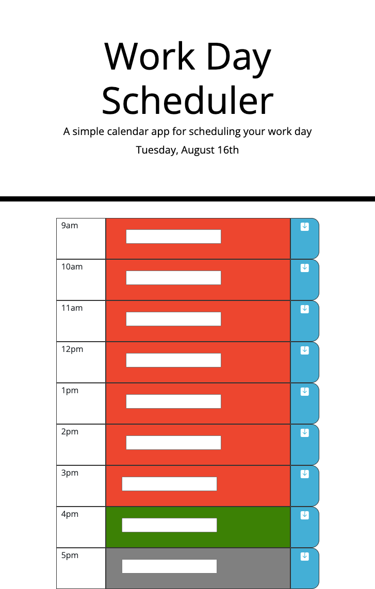

# Day-Scheduler

## Description
Created a work day schedule application where:
* It displays current date
* Rows are displayed by hour from 9 AM - 5 PM 
* The text area's color will change depending on time:
    * Green for current time
    * Red for past
    * Gray for future 
* You can type in the text area and have it saved 
* By clicking the save button, it is able to save what was written in the text area inside local storage. 
* After you leave the page or refresh it, what you had saved will be displayed there.

## Links
GitHub: 
https://github.com/MaSaLo13/Day-Scheduler

Deployed Site:
https://masalo13.github.io/Day-Scheduler/

