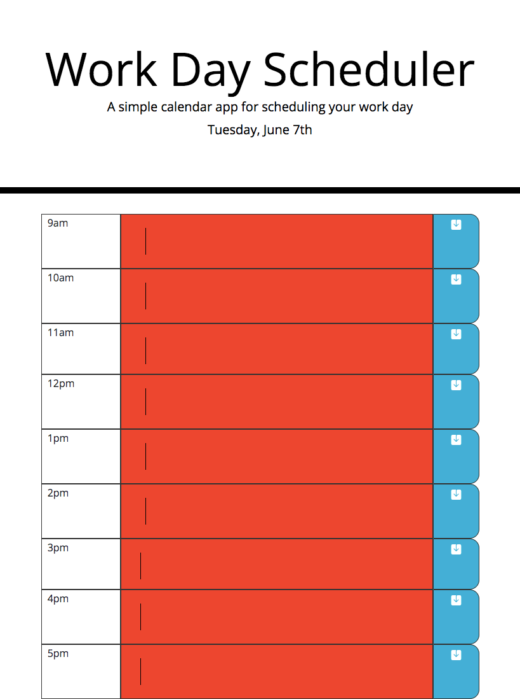

# Day-Scheduler

* Created a day scheduler 
    - Scheduler shows time from 9 AM - 5 PM 
    - The text area will display green for current time, red for past and gray for future. 
    - You can type in the text area / color filled area 
    - By clicking the save button, it is able to save what was written in the text area. 

# Screenshot of Day-Scheduler

repolink: 
https://github.com/MaSaLo13/Day-Scheduler

deployed site:
https://masalo13.github.io/Day-Scheduler/

